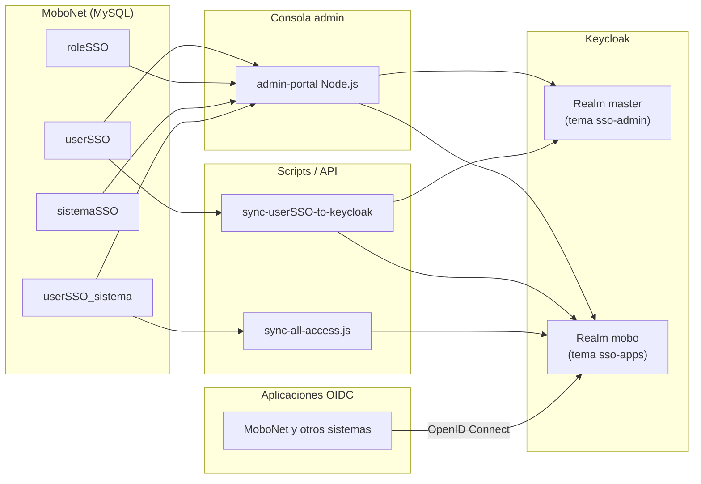

# Documentación del proyecto — UAT SSO MOBO

Este documento describe el **objetivo general**, el **funcionamiento** y los **requerimientos a nivel usuario** del proyecto. Para instrucciones de instalación y puesta en marcha, consulta [README.md](./README.md).

---

## Objetivo general

Este repositorio implementa **Single Sign-On (SSO)** para el ecosistema MOBO. La idea central es que **un solo login en Keycloak** sirva para acceder a múltiples aplicaciones conectadas, con **MySQL (MoboNet) como fuente maestra de usuarios** y Keycloak como proveedor de identidad (IdP).

En la práctica resuelve cuatro cosas:

1. **Centralizar identidades** — Los usuarios viven en `userSSO` y `roleSSO`; scripts y la consola admin los propagan hacia Keycloak.
2. **Unificar el acceso** — El usuario inicia sesión una vez y entra a todas las apps conectadas sin volver a escribir la contraseña.
3. **Separar tipos de acceso** — Consola de administración propia vs. portal de usuarios de las aplicaciones.
4. **Controlar acceso por sistema** — Cada app OIDC exige el rol de cliente `access`, asignado solo a usuarios vinculados en `userSSO_sistema`.

### Resumen en una frase

MOBO puede tener un login único, centralizado y con roles, donde MySQL es la verdad de los usuarios, Keycloak autentica, la consola admin administra usuarios/sistemas, y varias apps comparten sesión respetando permisos por sistema.

---

## Arquitectura



### Componentes principales

| Componente | Rol |
|------------|-----|
| **MoboNet (MySQL)** | Fuente maestra: usuarios, roles, sistemas y vínculos |
| **Keycloak** | Identity Provider (IdP); emite tokens y gestiona sesiones SSO |
| **admin-portal** | Consola MOBO: CRUD usuarios, roles, sistemas y vínculos |
| **Scripts PowerShell / Node** | Migraciones, alta de usuarios y sincronización MySQL → Keycloak |
| **Temas personalizados** | Dos pantallas de login (`sso-admin`, `sso-apps`) |
| **Aplicaciones OIDC** | Clientes registrados en `sistemaSSO` con validación de rol `access` |

### Realms y clientes en Keycloak

| Realm | Tema | Propósito |
|-------|------|-----------|
| `master` | `sso-admin` | Login de la consola admin (`admin-portal`) |
| `mobo` | `sso-apps` | Login de usuarios finales en aplicaciones |

Clientes registrados en el realm `mobo` (importados desde `keycloak-imports/realm-export.json` y gestionables en consola):

| Cliente | URL | Secreto |
|---------|-----|---------|
| `mobonet` | `http://mobonet.localhost/` | (ver `sistemaSSO`) |
| `admin-portal` | Consola admin (realm `master`) | `admin-portal-secret` |

Los demás sistemas se registran desde la consola admin en `sistemaSSO`.

---

## Cómo funciona (flujo)

### 1. Infraestructura

Keycloak corre en Docker (puerto 8089 en UAT, 8080 en local). La consola admin corre en Node (puerto 3010 en UAT, 3002 en local).

### 2. Alta y sincronización de usuarios

1. Los usuarios se crean en `userSSO` (consola o `insert-userSSO.ps1`).
2. La contraseña se guarda hasheada con bcrypt en `pass_hash`.
3. Scripts o el botón **Sincronizar todo** propagan perfil, contraseña y rol hacia Keycloak.
4. Usuarios huérfanos en Keycloak se eliminan al sincronizar.

### 3. Roles y accesos

| Rol | ID | Consola `:3002` | Apps (realm `mobo`) |
|-----|-----|-----------------|---------------------|
| **Admin** | `1` | Todo | Sí, si vinculado al sistema |
| **Usuario** | `2` | No | Sí, si vinculado al sistema |
| **developAdmin** | `3` | Solo sus sistemas | Sí, si vinculado |

Lógica de sincronización según rol:

- **Rol 1 (Admin)**: Existe en `mobo` y `master` (acceso consola + realm-admin en master).
- **Rol 3 (developAdmin)**: Existe en `mobo` y `master`, sin realm-admin completo.
- **Rol 2 (Usuario)**: Solo en `mobo`; se elimina de `master` si apareciera.

### 4. Acceso por sistema (Fase 4)

| Elemento | Descripción |
|----------|-------------|
| `sistemaSSO` | Catálogo de apps OIDC (`client_id`, URIs, owner, UUID Keycloak) |
| `userSSO_sistema` | Vinculación usuario ↔ sistema |
| Rol `access` | Rol de cliente en Keycloak por cada sistema |
| Enforcement | Flujo `browser-access-{clientId}` exige rol `access` al iniciar sesión |
| Apps | Validan `resource_access[clientId].roles` en el access token |

### 5. Autenticación en aplicaciones (OpenID Connect)

1. El usuario pulsa **Iniciar sesión con SSO** en la app.
2. Redirige al login de Keycloak (realm `mobo`, tema `sso-apps`).
3. Keycloak valida credenciales y, si aplica enforcement, comprueba rol `access`.
4. La app recibe el token y valida de nuevo el rol `access`.
5. Sin vínculo en `userSSO_sistema`, el login falla o la app muestra acceso denegado.

### 6. Single Sign-On (SSO)

Si el usuario ya tiene sesión activa en Keycloak, la segunda app no pide contraseña.

### 7. Single Log-Out (SLO)

Cerrar sesión en cualquier app invalida la sesión global en Keycloak.

---

## Requerimientos a nivel usuario

### Autenticación e identidad

| Requerimiento | Detalle |
|---------------|---------|
| **Identificador de login** | Campo **"No. de Empleado"** en tema `sso-apps` |
| **Contraseña** | Obligatoria en el primer acceso |
| **Cuenta activa** | Solo `enabled = 1` en `userSSO` |
| **Vinculación a sistema** | Obligatoria para entrar a cada app |

### Roles y permisos de acceso

| Requerimiento | Detalle |
|---------------|---------|
| **Usuario estándar (rol 2)** | Solo apps vinculadas; sin consola admin |
| **Administrador (rol 1)** | Consola completa + apps vinculadas |
| **developAdmin (rol 3)** | Consola limitada a sistemas propios; puede vincular usuarios solo a esos sistemas |

### Comportamiento SSO esperado

| Requerimiento | Detalle |
|---------------|---------|
| **Un login, varias apps** | SSO entre apps donde el usuario tenga `access` |
| **Cierre de sesión global** | SLO entre apps conectadas |
| **Aislamiento por sistema** | Usuario sin vínculo no entra a esa app |

---

## Modelo de datos

### Tabla `roleSSO`

```sql
-- 1 = Admin        → consola completa + apps vinculadas
-- 2 = Usuario      → solo apps vinculadas
-- 3 = developAdmin → consola parcial + apps vinculadas
```

### Tabla `userSSO`

Catálogo maestro de usuarios. Fuente de verdad para Keycloak.

### Tabla `sistemaSSO`

Catálogo de sistemas/aplicaciones OIDC gestionados desde la consola.

### Tabla `userSSO_sistema`

Vinculación N:M entre usuarios y sistemas. Determina quién recibe el rol `access` en cada cliente.

---

## Scripts de gestión

| Script | Propósito |
|--------|-----------|
| `start.ps1` | Keycloak + temas + cliente admin-portal |
| `create-userSSO-table.ps1` | Crea tablas base y usuario admin |
| `run-migration-05.ps1` | Crea `sistemaSSO`, `userSSO_sistema`, rol 3 |
| `run-migration-06.ps1` | Vincula admin a todos los sistemas |
| `run-migration-07.ps1` | Restaura sistema `mobonet` (mobonet.localhost) |
| `run-migration-08.ps1` | Elimina sistemas demo `node-app` / `php-app` |
| `insert-userSSO.ps1` | Alta en `userSSO` + Keycloak |
| `update-userSSO-password.ps1` | Cambia contraseña en MySQL y Keycloak |
| `sync-userSSO-to-keycloak.ps1` | Re-sincroniza perfiles + acceso + enforcement |
| `seed-initial-access.ps1` | Seed vínculos admin + sync acceso + devadmin opcional |
| `sync-all-access.js` | UUIDs, roles `access` y flujos de login por sistema |
| `register-admin-portal-client.ps1` | Registra cliente OIDC de la consola |

---

## Temas de login

| Tema | Uso | Aspecto |
|------|-----|---------|
| **sso-admin** | Consola `:3002` (realm `master`) | Oscuro, acento dorado |
| **sso-apps** | Apps (realm `mobo`) | Claro, azul/verde |

---

## Estado del repositorio

Este repositorio incluye:

- Keycloak (Docker Compose) + realm `mobo`
- Temas `sso-admin` y `sso-apps`
- Consola admin `admin-portal` (puerto 3010 en UAT)
- Esquema SQL completo con acceso por sistema
- Scripts de sincronización MySQL ↔ Keycloak

---

## Flujo de prueba del SSO

1. Ejecutar `seed-initial-access.ps1` para vincular `admin` a los sistemas existentes (p. ej. `mobonet`).
2. Abrir una aplicación conectada (p. ej. MoboNet) e iniciar sesión con SSO → login Keycloak → `admin` / `admin`.
3. Abrir otra app vinculada al mismo usuario → entra sin contraseña (SSO).
4. Crear un usuario rol 2 **sin** vincular a un sistema → login rechazado o acceso denegado.
5. Cerrar sesión en una app → las demás pierden sesión (SLO).

---

## Referencias

- [README.md](./README.md) — Instalación y puesta en marcha
- [themes/GUIA-PERSONALIZACION.md](./themes/GUIA-PERSONALIZACION.md) — Personalización de temas Keycloak
- [keycloak-imports/realm-export.json](./keycloak-imports/realm-export.json) — Configuración del realm `mobo`
