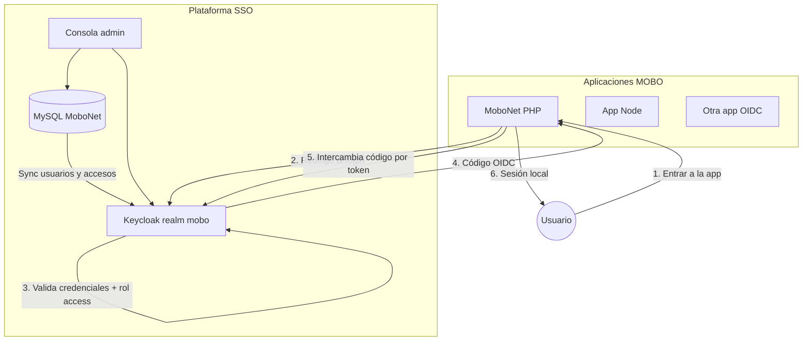

# Guía del proyecto SSO MOBO e integración de login

Documento orientado a **explicar el proyecto en lenguaje claro** y describir **cómo conectar el login SSO** a cada aplicación (PHP, Node u otras).

Para instalación y despliegue, ver [README.md](./README.md). Para arquitectura detallada, ver [DOCUMENTACION-PROYECTO.md](./DOCUMENTACION-PROYECTO.md).

---

## ¿Qué es este proyecto?

**UAT SSO MOBO** es la plataforma de **Single Sign-On (SSO)** de MOBO. Resuelve un problema concreto:

> Los empleados tienen **un solo usuario y contraseña** para entrar a varias aplicaciones internas (MoboNet, reportes, herramientas, etc.), y los administradores controlan **quién entra a qué sistema** desde un panel central.

### En una frase

MySQL guarda la verdad de los usuarios → Keycloak autentica → la consola admin gestiona accesos → cada app valida que el usuario tenga permiso para entrar.

### ¿Qué NO hace la app por sí sola?

La aplicación **no valida contraseñas localmente**. Delega la autenticación a Keycloak y solo se encarga de:

1. Redirigir al login central.
2. Recibir el código de autorización (OIDC).
3. Intercambiarlo por tokens en el **backend** (con el client secret).
4. Verificar que el usuario tenga acceso a **ese** sistema.
5. Crear la sesión propia de la app (PHP `$_SESSION`, Express `req.session`, etc.).

---

## Componentes principales

| Componente | Qué hace |
|----------|----------|
| **SSOMOBO (MySQL)** | Catálogo maestro: usuarios (`userSSO`), roles globales (`roleSSO`), sistemas (`sistemaSSO`) y vínculos usuario↔sistema (`userSSO_sistema`) |
| **Keycloak** | Proveedor de identidad (IdP). Emite tokens OIDC y mantiene la sesión SSO global |
| **Consola admin** (`admin-portal`) | CRUD de usuarios, sistemas, roles internos y vínculos de acceso |
| **Temas Keycloak** | `sso-admin` (consola) y `sso-apps` (aplicaciones) |
| **Cada aplicación** | Cliente OIDC que consume el login central |

### URLs de referencia

| Ambiente | Keycloak | Consola admin |
|----------|----------|---------------|
| **UAT (dominio)** | http://auth.uat.sso.mobo.com.mx | http://admin.uat.sso.mobo.com.mx |
| **UAT (IP)** | http://192.168.10.150:8089 | http://192.168.10.150:3010 |
| **Local** | http://localhost:8080 | http://localhost:3002 |

> En local, Keycloak usa el realm `mobo` en el puerto 8080. La consola admin usa el realm `master` con tema `sso-admin`.

---

## Arquitectura simplificada



---

## Conceptos que hay que entender

### Realms de Keycloak

| Realm | Quién entra | Tema |
|-------|-------------|------|
| `master` | Administradores de la consola SSO | `sso-admin` |
| `mobo` | Usuarios finales de las aplicaciones | `sso-apps` |

**Todas las apps de negocio se conectan al realm `mobo`.**

### Roles globales (`roleSSO`) — quién administra el SSO

| ID | Rol | Consola admin | Apps |
|----|-----|:-------------:|:----:|
| 1 | Admin | Acceso total | Sí, si está vinculado |
| 2 | Usuario | No | Sí, si está vinculado |
| 3 | developAdmin | Solo sus sistemas | Sí, si está vinculado |

Estos roles viven en MySQL y se sincronizan a Keycloak. **No son los permisos dentro de cada app.**

### Rol `access` — quién puede entrar a una app

Cada sistema registrado en `sistemaSSO` tiene un **cliente OIDC** en Keycloak (por ejemplo `mobonet`, `mi-reportes`).

Para que un usuario entre a esa app necesita:

1. Existir en `userSSO` y estar activo.
2. Estar **vinculado** al sistema en `userSSO_sistema`.
3. Tener el **client role** `access` en ese cliente (lo asigna la sincronización automática).

Sin vínculo → Keycloak o la app rechazan el acceso.

### Roles internos — permisos **dentro** de cada app

Además de `access`, cada sistema puede definir roles propios en `sistemaRoleSSO` (por ejemplo `admin`, `usuario`, `consulta`).

En el token OIDC aparecen así:

```json
{
  "resource_access": {
    "mobonet": {
      "roles": ["access", "admin", "consulta"]
    }
  }
}
```

- `access` → puede entrar al sistema.
- `admin`, `usuario`, `consulta`, … → permisos internos de la app (puede haber **varios** a la vez).

Plantillas listas para leer estos roles: [`templates/sso-app/`](./templates/sso-app/).

Para poblar vínculos y multi-rol en masa, ver la sección **Roles internos múltiples** más abajo y la consola **Docs / Seeders**.

---

## Flujo de login (paso a paso)

```
Usuario → App → Keycloak (login) → App (/callback) → Sesión local
```

1. El usuario abre la app (ej. MoboNet).
2. La app no tiene sesión → redirige a Keycloak:
   ```
   GET /realms/mobo/protocol/openid-connect/auth
     ?client_id=mi-app
     &redirect_uri=https://mi-app.ejemplo/callback
     &response_type=code
     &scope=openid profile email
     &state=...
   ```
3. Keycloak muestra el login (`sso-apps`). El usuario escribe **No. de Empleado** y contraseña.
4. Keycloak valida credenciales y, si aplica, que el usuario tenga rol `access` en ese cliente.
5. Keycloak redirige de vuelta a la app con `?code=...&state=...`.
6. El **backend** de la app llama a `/token` con el código + **client secret** y recibe `access_token`, `refresh_token`, `id_token`.
7. La app valida `resource_access[client_id].roles` incluye `access`.
8. La app crea su sesión local con el perfil del usuario y roles internos.

### Single Sign-On (SSO)

Si el usuario ya tiene sesión activa en Keycloak, al abrir otra app vinculada **no vuelve a escribir la contraseña** (Keycloak emite el código directamente).

### Single Log-Out (SLO)

Al cerrar sesión en una app, se invalida la sesión global en Keycloak. Las demás apps pierden acceso en su siguiente verificación.

---

## Antes de integrar: registrar el sistema

Todo sistema nuevo debe darse de alta **en la consola admin** (Sistemas) o en `sistemaSSO`. Eso crea automáticamente:

- Cliente OIDC en Keycloak (realm `mobo`).
- Rol de cliente `access`.
- Flujo de enforcement de acceso (si está configurado).

### Datos que necesitarás

| Campo | Ejemplo | Notas |
|-------|---------|-------|
| `client_id` | `mi-reportes` | Identificador único del sistema |
| Redirect URIs | `https://reportes.mobo.com/*` | **Deben coincidir exactamente** con lo que envía la app |
| Web origins | `+` o URL explícita | Para CORS si aplica |
| Client secret | (generado) | Solo en backend; nunca en el frontend |

> **Importante:** `http://localhost:3002` y `http://127.0.0.1:3002` son URLs distintas para Keycloak. Registra la que usará la app.

### Vincular usuarios

En la consola admin → Usuarios → vincular al sistema. Eso crea la fila en `userSSO_sistema` y sincroniza el rol `access` en Keycloak.

---

## Integración en aplicaciones PHP

Referencia completa: [`scripts/_KeycloakSSO.php`](./scripts/_KeycloakSSO.php) (implementación de MoboNet).

### 1. Configuración (`sso-config.php`)

```php
<?php
define('SSO_KC_BASE', 'http://auth.uat.sso.mobo.com.mx/realms/mobo/protocol/openid-connect');
define('SSO_CLIENT_ID', 'mi-app');
define('SSO_CLIENT_SECRET', 'el-secret-de-la-consola-admin');
define('SSO_REDIRECT_URI', 'https://mi-app.mobo.com/sso-callback');
```

| Variable | Descripción |
|----------|-------------|
| `SSO_KC_BASE` | URL base OIDC del realm `mobo` (termina en `/protocol/openid-connect`) |
| `SSO_CLIENT_ID` | `client_id` registrado en Sistemas |
| `SSO_CLIENT_SECRET` | Secreto OIDC (backend only) |
| `SSO_REDIRECT_URI` | URL exacta del callback |

### 2. Copiar clases base

```
core/
├── KeycloakSSO.php      ← lógica OIDC (login, callback, tokens, logout)
├── SsoAppRoles.php      ← copiar de templates/sso-app/php/SsoAppRoles.php
└── sso-config.php
```

### 3. Rutas mínimas

| Ruta | Acción |
|------|--------|
| `/` o login | `KeycloakSSO::redirectToLogin()` |
| `/sso-callback` | `KeycloakSSO::handleCallback()` → crear sesión de la app |
| `/sso-logout` | Responder 200 (front-channel logout de Keycloak) |

Ejemplo de enrutamiento (como MoboNet):

```php
if ($ruta === 'sso-callback') {
    $sso = KeycloakSSO::handleCallback();

    if (empty($sso['has_access'])) {
        // Usuario autenticado en Keycloak pero sin vínculo a este sistema
        header('Location: /?sso_error=Sin acceso');
        exit;
    }

    $_SESSION['mi_app'] = [
        'usuario'   => $sso['username'],
        'nombre'    => $sso['nombre'],
        'email'     => $sso['email'],
        'sso_roles' => $sso['internal_roles'],
        'sso_role'  => $sso['primary_role'],
    ];
    header('Location: /dashboard');
    exit;
}
```

### 4. Proteger páginas

```php
session_start();
require_once 'core/KeycloakSSO.php';

if (empty($_SESSION['mi_app'])) {
    KeycloakSSO::redirectToLogin();
}

// Verificar que la sesión SSO sigue vigente (cada ~30 s en requests)
if (!KeycloakSSO::ensureSessionActive() || !KeycloakSSO::hasSystemAccess()) {
    session_destroy();
    KeycloakSSO::redirectToLogin();
}
```

### 5. Restringir por rol interno

```php
if (!KeycloakSSO::hasInternalRole('admin')) {
    KeycloakSSO::requireInternalRole('admin'); // redirige con error
}
```

### 6. Cerrar sesión

Logout en la **misma pestaña** (redirect 302 → Keycloak → vuelve a tu app).
No uses `window.open` ni `target="_blank"`.

Importante: genera la URL de logout **antes** de destruir la sesión, para enviar `id_token_hint` y evitar la pantalla de confirmación de Keycloak.

```php
// Recomendado
KeycloakSSO::logoutRedirect(); // usa SSO_POST_LOGOUT_URI o SERVERURL

// Equivalente manual
$logoutUrl = KeycloakSSO::logoutUrl(); // lee id_token de la sesión
$_SESSION = [];
session_destroy();
header('Location: ' . $logoutUrl);
exit;
```

En Keycloak, el cliente debe tener **Valid post logout redirect URIs** (la consola lo pone en `+` = mismas que redirect URIs).

---

## Integración en aplicaciones Node.js / Express

La consola admin usa `openid-client`. Las apps de negocio pueden seguir el mismo patrón.

### 1. Dependencias

```bash
npm install express express-session openid-client dotenv
```

### 2. Variables de entorno (`.env`)

```env
PORT=9000
SESSION_SECRET=un-secreto-largo

KEYCLOAK_URL=http://auth.uat.sso.mobo.com.mx/realms/mobo
CLIENT_ID=mi-app
CLIENT_SECRET=el-secret-de-la-consola-admin
REDIRECT_URL=https://mi-app.mobo.com/callback
```

### 3. Configurar cliente OIDC

```javascript
const { Issuer, generators } = require('openid-client');

const issuer = await Issuer.discover(process.env.KEYCLOAK_URL);
const client = new issuer.Client({
    client_id: process.env.CLIENT_ID,
    client_secret: process.env.CLIENT_SECRET,
    redirect_uris: [process.env.REDIRECT_URL],
    response_types: ['code'],
});
```

### 4. Rutas de auth

```javascript
// Iniciar login
app.get('/login', (req, res) => {
    const state = generators.state();
    const nonce = generators.nonce();
    req.session.state = state;
    req.session.nonce = nonce;
    res.redirect(client.authorizationUrl({
        scope: 'openid profile email',
        state,
        nonce,
    }));
});

// Callback
app.get('/callback', async (req, res) => {
    const params = client.callbackParams(req);
    const tokenSet = await client.callback(process.env.REDIRECT_URL, params, {
        state: req.session.state,
        nonce: req.session.nonce,
    });

    const payload = tokenSet.claims();
    const { hasSystemAccess, getInternalRoles } = require('./lib/sso-roles');

    if (!hasSystemAccess(payload, process.env.CLIENT_ID)) {
        return res.status(403).send('No tienes acceso a este sistema');
    }

    req.session.user = {
        username: payload.preferred_username,
        email: payload.email,
        roles: getInternalRoles(payload, process.env.CLIENT_ID),
    };
    req.session.tokenSet = tokenSet;
    res.redirect('/');
});
```

Copia [`templates/sso-app/node/sso-roles.js`](./templates/sso-app/node/sso-roles.js) a `lib/sso-roles.js`.

### 5. Middleware de protección

```javascript
function requireAuth(req, res, next) {
    if (!req.session.user) return res.redirect('/login');
    next();
}

function requireRole(codigo) {
    const { hasInternalRole } = require('./lib/sso-roles');
    return (req, res, next) => {
        const payload = req.session.tokenSet?.claims?.() ?? {};
        if (!hasInternalRole(payload, process.env.CLIENT_ID, codigo)) {
            return res.status(403).send('Acceso denegado');
        }
        next();
    };
}

app.get('/admin', requireAuth, requireRole('admin'), (req, res) => {
    res.send('Panel admin');
});
```

### 6. Logout

Misma pestaña: `res.redirect` al end_session de Keycloak (nunca `window.open`).

```javascript
app.get('/logout', (req, res) => {
    const idToken = req.session.tokenSet?.id_token; // capturar ANTES de destroy
    const postLogout = 'https://mi-app.mobo.com/';
    req.session.destroy(() => {
        if (!idToken) return res.redirect('/');
        res.redirect(client.endSessionUrl({
            id_token_hint: idToken,
            client_id: process.env.CLIENT_ID,
            post_logout_redirect_uri: postLogout,
        }));
    });
});
```

---

## Integración en otros stacks (Python, .NET, Java, etc.)

El patrón es el mismo en cualquier lenguaje:

1. Registrar el sistema en la consola admin.
2. Implementar **Authorization Code Flow** (OIDC) contra el realm `mobo`.
3. Usar una librería OIDC estándar del ecosistema (Authlib, Microsoft.Identity.Web, Spring Security OAuth2, etc.).
4. Validar `resource_access[<client_id>].roles` contiene `access`.
5. Leer roles internos para autorización fina dentro de la app.

Discovery URL:

```
http://auth.uat.sso.mobo.com.mx/realms/mobo/.well-known/openid-configuration
```

Endpoints principales (derivados del discovery):

| Endpoint | Uso |
|----------|-----|
| `authorization_endpoint` | Redirigir al login |
| `token_endpoint` | Intercambiar código por tokens |
| `userinfo_endpoint` | Obtener perfil del usuario |
| `end_session_endpoint` | Cerrar sesión global |

---

## Checklist de integración por proyecto

Usa esta lista al conectar una app nueva:

- [ ] Sistema registrado en consola admin (`client_id`, redirect URIs, secret).
- [ ] Redirect URI en Keycloak **coincide exactamente** con la de la app (incluyendo `localhost` vs `127.0.0.1`).
- [ ] Client secret guardado solo en servidor (`.env`, `sso-config.php`, variables de entorno).
- [ ] Ruta `/callback` (o equivalente) implementada en el **backend**.
- [ ] Validación de rol `access` después del login.
- [ ] Sesión local creada con datos del token.
- [ ] Rutas protegidas redirigen a login si no hay sesión.
- [ ] Logout llama a `end_session_endpoint` de Keycloak.
- [ ] Usuarios de prueba vinculados al sistema en consola admin.
- [ ] (Opcional) Roles internos copiados desde `templates/sso-app/`.

---

## Errores frecuentes

| Error | Causa habitual | Solución |
|-------|----------------|----------|
| `Parámetro no válido: redirect_uri` | La URL del callback no está registrada o difiere (`localhost` ≠ `127.0.0.1`) | Ajustar redirect URIs en consola admin / Keycloak |
| Login OK en Keycloak pero acceso denegado en la app | Usuario sin vínculo en `userSSO_sistema` | Vincular usuario al sistema en consola admin |
| `Invalid client credentials` | Client secret incorrecto | Copiar secret desde consola admin → Sistemas |
| Token sin rol `access` | Sincronización pendiente | Ejecutar sync desde consola o `sync-userSSO-to-keycloak.ps1` |
| SSO no funciona entre apps | Dominios/cookies distintos o sesión Keycloak expirada | Verificar que todas usan el mismo Keycloak y realm `mobo` |

---

## Consola: módulo Ayuda (DevelopAdmin)

En la consola admin, el menú **Ayuda** (`/ayuda`) explica paso a paso cómo un DevelopAdmin registra su sistema, guarda el secreto, crea roles internos, vincula usuarios y enlaza el login OIDC en la aplicación.

Atajo desde **Sistemas → ¿Cómo registro mi app?**.

---

## Roles internos múltiples por sistema

Un usuario vinculado a un sistema puede tener **varios roles internos** a la vez (por ejemplo `admin` + `consulta`). En la consola: **Sistemas → abrir → Usuarios con acceso → Roles**.

En MySQL:

| Tabla | Uso |
|-------|-----|
| `sistemaRoleSSO` | Catálogo de roles del sistema |
| `userSSO_sistema` | Vínculo usuario↔sistema (+ rol “primario” legacy) |
| `userSSO_sistema_role` | N roles internos por usuario/sistema |

En Keycloak quedan como client roles del cliente OIDC, además de `access`.

### Seeders API (poblar accesos)

Base: `http://localhost:3002/api/seed` (UAT: puerto/host de la consola).

1. `POST /api/seed/login` — token Bearer (**Admin** o **DevelopAdmin**).
2. `GET /api/seed/catalog` — puestos, sistemas y códigos de roles (DevelopAdmin: solo sus sistemas).
3. `POST /api/seed/sistemas/usuarios` — poblar usuarios de un sistema con **varios roles**:

```json
{
  "items": [
    {
      "client_id": "mobonet",
      "usuarios": [
        { "user": "10001", "role_codigos": ["admin", "consulta"] },
        { "user": "10002", "role_codigos": ["usuario"] }
      ]
    }
  ]
}
```

También: `POST /api/seed/usuario/login` (usuario normal → mismo JSON de sesión SSO, útil para chatbots).

También existen `POST /api/seed/puestos/roles`, `POST /api/seed/usuarios/roles` y `POST /api/seed/reaplicar-puestos`.

Documentación interactiva en la consola: **Docs / Seeders**.

---

## Cómo explicarlo a un equipo no técnico

> "Tenemos un login central de MOBO. Cuando entras a cualquier sistema conectado, la pantalla de usuario y contraseña es la misma. El administrador decide en un panel quién puede entrar a cada aplicación. Si ya iniciaste sesión en una app, en la siguiente no te vuelve a pedir contraseña. Si te quitan acceso a un sistema, dejas de entrar aunque sigas autenticado en los demás donde sí tengas permiso."

---

## Referencias en este repositorio

| Recurso | Ubicación |
|---------|-----------|
| Instalación y despliegue | [README.md](./README.md) |
| Arquitectura y flujos internos | [DOCUMENTACION-PROYECTO.md](./DOCUMENTACION-PROYECTO.md) |
| Seeders API (roles multi / puestos / usuarios) | Consola → **Docs / Seeders** · [`admin-portal/routes/api/seed.js`](./admin-portal/routes/api/seed.js) |
| Plantillas PHP/Node para roles | [templates/sso-app/](./templates/sso-app/) |
| Implementación de referencia PHP | [scripts/_KeycloakSSO.php](./scripts/_KeycloakSSO.php) |
| Consola admin (OIDC con `openid-client`) | [admin-portal/index.js](./admin-portal/index.js) |
| Personalización de pantallas de login | [themes/GUIA-PERSONALIZACION.md](./themes/GUIA-PERSONALIZACION.md) |
